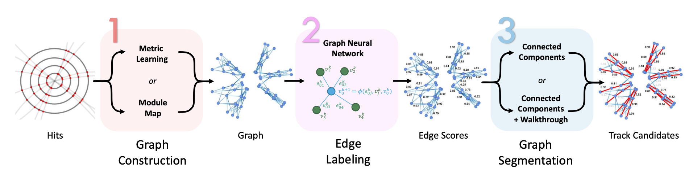

---

##### Download

+ [Paper](epjconf_chep2024_03030.pdf)
+ [Code and data](https://gitlab.cern.ch/gnn4itkteam/acorn)

---

##### Abstract

Particle tracking is vital for the ATLAS physics programs. To cope with the increased number of particles in the High Luminosity LHC, ATLAS is building a new all-silicon Inner Tracker (ITk), consisting of a Pixel and a Strip subdetector. At the same time, ATLAS is developing new track reconstruction algorithms that can operate in the HL-LHC dense environment. A track reconstruction algorithm needs to solve two problems: track finding for building track candidates and track fitting for obtaining track parameters of those track candidates. Previously, we developed GNN4ITk, a track-finding algorithm based on a Graph Neural Network (GNN), and achieved good track-finding performance under realistic HL-LHC conditions. Our GNN pipeline relied only on the 3D spacepoint positions. This work introduces heterogeneous GNN models to fully exploit the subdetector-dependent features of ITk data, improving the performance of our GNN4ITk pipeline. In addition, we interfaced our pipeline to the standard ATLAS track-fitting algorithm and data model. With that, the GNN4ITk pipeline produces full-fledged track candidates that can be used for any downstream analyses and compared with the other track reconstruction algorithms.

---

##### Figure 6: The GNN4ITk pipeline implementation



---

##### Citation

Physics Performance of the ATLAS GNN4ITk Track Reconstruction Chain
Sylvain Caillou, Paolo Calafiura, Xiangyang Ju, Daniel Murnane, Tuan Pham, Charline Rougier, Jan Stark and Alexis Vallier
EPJ Web of Conf., 295 (2024) 03030
DOI: https://doi.org/10.1051/epjconf/202429503030

```BibTeX
@article{ refId0,
author = {{Caillou, Sylvain} and {Calafiura, Paolo} and {Ju, Xiangyang} and {Murnane, Daniel} and {Pham, Tuan} and {Rougier, Charline} and {Stark, Jan} and {Vallier, Alexis}},
title = {Physics Performance of the ATLAS GNN4ITk Track Reconstruction Chain},
DOI= "10.1051/epjconf/202429503030",
url= "https://doi.org/10.1051/epjconf/202429503030",
journal = {EPJ Web of Conf.},
year = 2024,
volume = 295,
pages = "03030",
}
```

<!-- --- -->

<!-- ##### Related material

+ [Presentation slides](presentation1.pdf)
+ [Summary of the paper](https://www.penguinrandomhouse.com/books/110403/unusual-uses-for-olive-oil-by-alexander-mccall-smith/) -->
