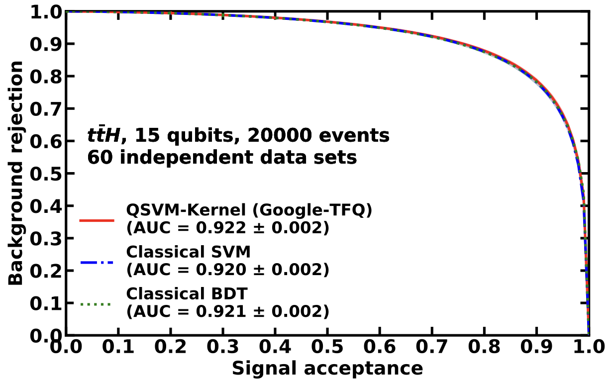

---

##### Download

+ [Paper](PhysRevResearch.3.033221.pdf)
<!-- + [Code and data](https://gitlab.cern.ch/gnn4itkteam/acorn) -->

---

##### Abstract

Quantum machine learning could possibly become a valuable alternative to classical machine learning for applications in high energy physics by offering computational speedups. In this study, we employ a support vector machine with a quantum kernel estimator (QSVM-Kernel method) to a recent LHC flagship physics analysis: $t\bar{t}H$ (Higgs boson production in association with a top quark pair). In our quantum simulation study using up to 20 qubits and up to 50000 events, the QSVM-Kernel method performs as well as its classical counterparts in three different platforms from Google Tensorflow Quantum, IBM Quantum, and Amazon Braket. Additionally, using 15 qubits and 100 events, the application of the QSVM-Kernel method on the IBM superconducting quantum hardware approaches the performance of a noiseless quantum simulator. Our study confirms that the QSVM-Kernel method can use the large dimensionality of the quantum Hilbert space to replace the classical feature space in realistic physics data sets.

---

##### Figure 4: Overlay of the Receiver Operating Characteristic from the QSVM-kernel algorithm, the classical SVM, and the classical BDT classifiers evaluated on 20000 $t\bar{t}H$ events.



---

##### Citation

S. L. Wu, S. Sun, W. Guan, C. Zhou, J. Chan, C. L. Cheng, T. Pham, Y. Qian, A. Wang, R. Zhang, M. Livny, J. Glick, P. Barkoutsos, S. Woerner, I. Tavernelli, F. Carminati, A. Di Meglio, A. C. Y. Li, J. Lykken, P. Spentzouris, S. Y. Chen, S. Yoo, T. Wei. Application of quantum machine learning using the quantum kernel algorithm on high energy physics analysis at the LHC. Phys. Rev. Research 3, 033221. 
DOI: [10.1103/PhysRevResearch.3.033221 ](https://doi.org/10.1103/PhysRevResearch.3.033221)

```BibTeX
@article{PhysRevResearch.3.033221,
title = {Application of quantum machine learning using the quantum kernel algorithm on high energy physics analysis at the LHC},
author = {Wu, Sau Lan and Sun, Shaojun and Guan, Wen and Zhou, Chen and Chan, Jay and Cheng, Chi Lung and Pham, Tuan and Qian, Yan and Wang, Alex Zeng and Zhang, Rui and Livny, Miron and Glick, Jennifer and Barkoutsos, Panagiotis Kl. and Woerner, Stefan and Tavernelli, Ivano and Carminati, Federico and Di Meglio, Alberto and Li, Andy C. Y. and Lykken, Joseph and Spentzouris, Panagiotis and Chen, Samuel Yen-Chi and Yoo, Shinjae and Wei, Tzu-Chieh},
journal = {Phys. Rev. Res.},
volume = {3},
issue = {3},
pages = {033221},
numpages = {9},
year = {2021},
month = {Sep},
publisher = {American Physical Society},
doi = {10.1103/PhysRevResearch.3.033221},
url = {https://link.aps.org/doi/10.1103/PhysRevResearch.3.033221}
}

```

<!-- --- -->

<!-- ##### Related material

+ [Presentation slides](presentation1.pdf)
+ [Summary of the paper](https://www.penguinrandomhouse.com/books/110403/unusual-uses-for-olive-oil-by-alexander-mccall-smith/) -->
