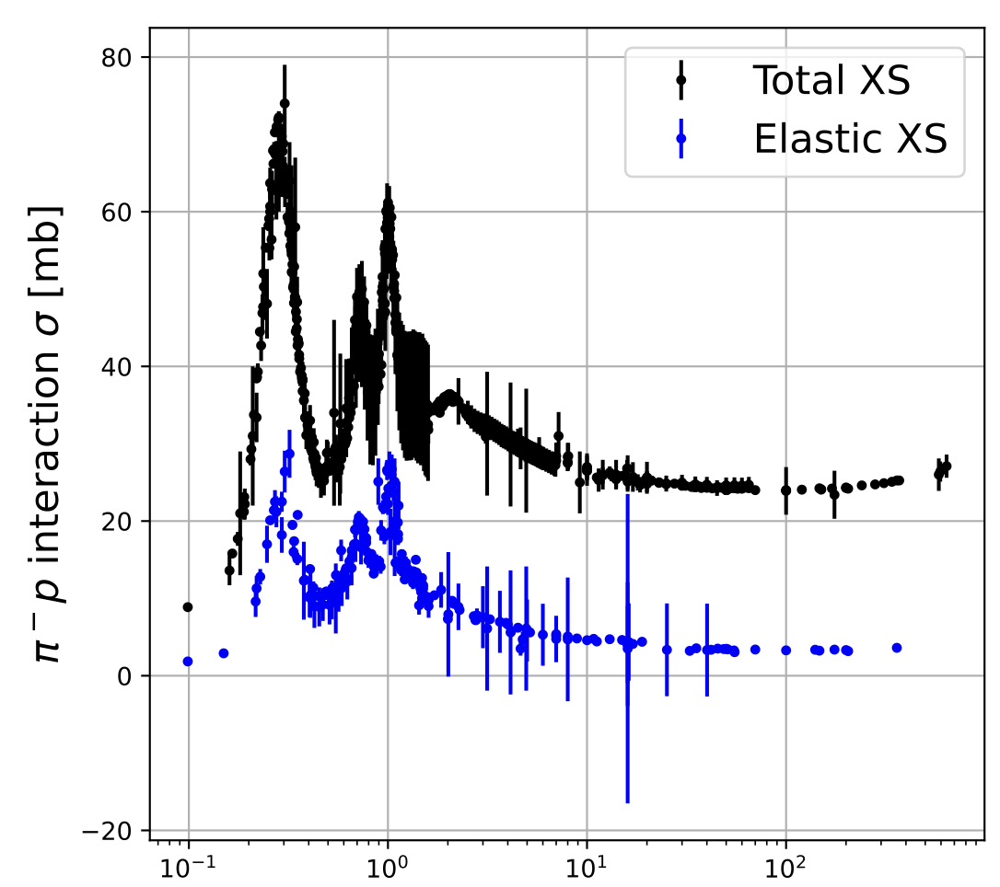

---

##### Download

+ [Paper](epjconf_chep2024_09034.pdf)
<!-- + [Code and data](https://gitlab.cern.ch/gnn4itkteam/acorn) -->

---

##### Abstract

Accurate simulation of detector responses to hadrons is paramount for all physics programs at the Large Hadron Collider (LHC). Central to this simulation is the modeling of hadronic interactions. Unfortunately, the absence of first-principle theoretical guidance has made this a formidable challenge. The state-of-the-art simulation tool, Geant4, currently relies on phenomenology-inspired parametric models. Each model is designed to simulate hadronic interactions within specific energy ranges and for particular types of hadrons. Despite dedicated tuning efforts, these models sometimes fail to describe the data in certain physics processes accurately. Furthermore, finetuning these models with new measurements is laborious. Our research endeavors to leverage generative models to simulate hadronic interactions. While our ultimate goal is to train a generative model using experimental data, we have taken a crucial step by training conditional normalizing flow models with Geant4 simulation data. Our work marks a significant stride toward developing a fully differentiable and data-driven model for hadronic interactions in High Energy and Nuclear Physics.

---

##### Figure 6: Total and elastic cross section of $\pi^- p$ scattering as a function of pion kinetic energy in the lab frame.



---

##### Citation

Simulation of Hadronic Interactions with Deep Generative Models
Tuan Minh Pham and Xiangyang Ju
EPJ Web of Conf., 295 (2024) 09034
DOI: https://doi.org/10.1051/epjconf/202429509034

```BibTeX
@article{ refId0,
author = {{Pham, Tuan Minh} and {Ju, Xiangyang}},
title = {Simulation of Hadronic Interactions with Deep Generative Models},
DOI= "10.1051/epjconf/202429509034",
url= "https://doi.org/10.1051/epjconf/202429509034",
journal = {EPJ Web of Conf.},
year = 2024,
volume = 295,
pages = "09034",
}
```

<!-- --- -->

<!-- ##### Related material

+ [Presentation slides](presentation1.pdf)
+ [Summary of the paper](https://www.penguinrandomhouse.com/books/110403/unusual-uses-for-olive-oil-by-alexander-mccall-smith/) -->
